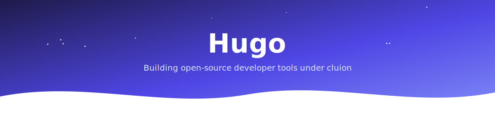

### Headless UI libraries · CLI tools · Self-hosted apps

  

  

 

I build open-source developer tools under [**cluion**](https://cluion.com) —
from headless component libraries to disk cleaners and self-hosted sync.

 

---

## Featured Projects

<table>
<tr>
<td width="50%" valign="top">

### [🦡 Mogura](https://github.com/cluion/Mogura)

Interactive disk cleaner and analyzer for Linux —
a single static binary with no dependencies

 

</td>
<td width="50%" valign="top">

### [🌿 trellis](https://github.com/cluion/trellis)

Modern headless datatable engine —
plugin-based, immutable state, full-stack ready

 

</td>
</tr>
<tr>
<td width="50%" valign="top">

### [📝 verso-editor](https://github.com/cluion/verso-editor)

Headless, extensible rich text editor built on ProseMirror —
46 built-in extensions, bring your own UI

 

</td>
<td width="50%" valign="top">

### [🎛️ selkit](https://github.com/cluion/selkit)

Headless, framework-agnostic select components
for JavaScript, Vue, and React

 

</td>
</tr>
<tr>
<td width="50%" valign="top">

### [🔄 obsync](https://github.com/cluion/obsync)

Self-hosted real-time sync for Obsidian vaults —
Go server, Rust client, WebSocket

 

</td>
<td width="50%" valign="top">

### [🤖 turing](https://github.com/cluion/turing)

Modern captcha for the web —
stateless tokens, CSP-safe, Laravel + JavaScript

 

</td>
</tr>
</table>

**More** — [sigil](https://github.com/cluion/sigil) · [loupedb](https://github.com/cluion/loupedb) · [vigila](https://github.com/cluion/vigila) · [paq](https://github.com/cluion/paq) · [zh-finder](https://github.com/cluion/zh-finder)

---

<picture>
  <source media="(prefers-color-scheme: dark)" srcset="https://raw.githubusercontent.com/cluion/cluion/output/github-contribution-grid-snake-dark.svg" />
  
</picture>

 

📫 ningyungame@gmail.com

